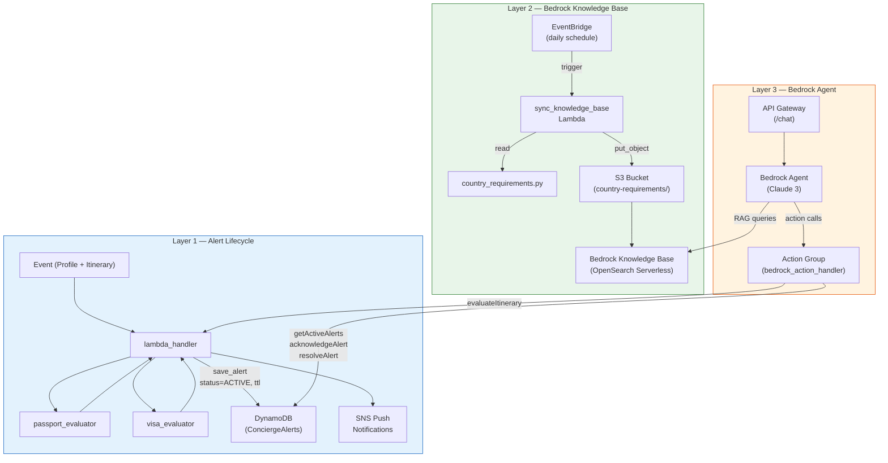

# Delta Concierge Proactive Alert System

A mock implementation of the Delta Air Lines Concierge proactive alert system, built as AWS Lambda functions in Python 3.11. The system evaluates travelers' passport and visa status against their upcoming itineraries, manages alert lifecycles in DynamoDB, syncs country-specific requirements to an Amazon Bedrock Knowledge Base, and exposes a conversational Bedrock Agent for traveler self-service.

## Architecture



## Project Structure

```
delta-concierge-alerts/
├── src/
│   ├── __init__.py
│   ├── models/
│   │   ├── __init__.py
│   │   └── types.py                  # Dataclasses, enums (AlertStatus, AlertSeverity, etc.)
│   ├── evaluators/
│   │   ├── __init__.py
│   │   ├── passport_evaluator.py     # Passport expiry evaluation logic
│   │   └── visa_evaluator.py         # Visa requirements evaluation logic
│   ├── services/
│   │   ├── __init__.py
│   │   ├── notification_service.py   # SNS push notification publishing
│   │   └── alert_store.py            # DynamoDB alert persistence & lifecycle
│   ├── handlers/
│   │   ├── __init__.py
│   │   ├── lambda_handler.py         # Primary Lambda — evaluate & alert
│   │   ├── sync_knowledge_base.py    # Lambda — sync country reqs to S3 for KB
│   │   └── bedrock_action_handler.py # Lambda — Bedrock Agent Action Group
│   ├── data/
│   │   ├── __init__.py
│   │   └── country_requirements.py   # Country-specific travel doc requirements
│   └── config.py                     # Configuration constants & env vars
├── docs/
│   ├── dynamodb-gsi.md               # GSI schema & CloudFormation snippet
│   ├── bedrock-knowledge-base-setup.md  # KB setup guide
│   ├── bedrock-agent-setup.md        # Agent setup guide
│   └── action-group-openapi.yaml     # OpenAPI schema for Action Group
├── tests/
├── requirements.txt
└── README.md
```

## How It Works

### Layer 1 — Alert Lifecycle

1. The Lambda handler receives an event containing a **SkyMiles profile** (with passport and visa details) and a **travel itinerary** (with flight segments).
2. The **passport evaluator** checks whether the traveler's passport meets each destination country's validity requirements.
3. The **visa evaluator** checks whether the traveler has valid visas for countries that require them, accounting for nationality exemptions and transit rules.
4. Any alerts are persisted to **DynamoDB** with `status=ACTIVE` and a `ttl` set 30 days after the last segment's arrival, then delivered as **push notifications** via Amazon SNS.
5. Alerts progress through the lifecycle: `ACTIVE` → `ACKNOWLEDGED` → `RESOLVED` (or `EXPIRED` after TTL).

### Layer 2 — Bedrock Knowledge Base (RAG)

1. A scheduled Lambda (`sync_knowledge_base`) reads country requirements and uploads structured JSON documents to S3.
2. An Amazon Bedrock Knowledge Base indexes the S3 documents via OpenSearch Serverless.
3. The Bedrock Agent queries the Knowledge Base to answer traveler questions about visa rules, passport validity, embassy contacts, and e-visa portals.

See [`docs/bedrock-knowledge-base-setup.md`](docs/bedrock-knowledge-base-setup.md) for full setup instructions.

### Layer 3 — Bedrock Agent

1. An Amazon Bedrock Agent (powered by Claude 3) combines the Knowledge Base with an Action Group.
2. The Action Group Lambda (`bedrock_action_handler`) exposes four actions: `getActiveAlerts`, `acknowledgeAlert`, `resolveAlert`, and `evaluateItinerary`.
3. An API Gateway endpoint exposes the agent as an HTTP `/chat` endpoint for the mobile app or Amazon Connect voice channel.

See [`docs/bedrock-agent-setup.md`](docs/bedrock-agent-setup.md) and [`docs/action-group-openapi.yaml`](docs/action-group-openapi.yaml).

## Alert Severity Levels

| Severity | Meaning |
|----------|---------|
| **CRITICAL** | Missing documents, expired passport/visa, or passport expires before travel |
| **WARNING** | Passport doesn't meet destination's validity window, or visa expires on travel date |
| **INFO** | Passport expiring within 6 months, or visa expiring within 30 days of travel |

## Invoking the Lambda Handler Locally

```python
from src.handlers.lambda_handler import handler

event = {
    "profile": {
        "skymiles_number": "1234567890",
        "first_name": "Jane",
        "last_name": "Doe",
        "nationality": "US",
        "passport_number": "P12345678",
        "passport_expiry": "2026-09-15",
        "endpoint_arn": "arn:aws:sns:us-east-1:123456789012:endpoint/APNS/DeltaApp/abc123",
        "visa_records": [
            {
                "country_code": "CN",
                "visa_type": "TOURIST",
                "issue_date": "2025-01-10",
                "expiry_date": "2026-01-10",
                "visa_number": "V98765432"
            }
        ]
    },
    "itinerary": {
        "confirmation_number": "DL-ABC123",
        "segments": [
            {
                "flight_number": "DL100",
                "origin": "ATL",
                "destination": "DE",
                "departure_date": "2026-06-15",
                "arrival_date": "2026-06-16",
                "is_layover": false
            },
            {
                "flight_number": "DL200",
                "origin": "DE",
                "destination": "CN",
                "departure_date": "2026-06-20",
                "arrival_date": "2026-06-21",
                "is_layover": false
            }
        ]
    },
    "requirements_override": null
}

response = handler(event, None)
print(response)
```

### Example Response

```json
{
    "statusCode": 200,
    "body": {
        "alerts_sent": 1,
        "passport_status": "INFO",
        "visa_status": "CRITICAL"
    }
}
```

## Event Schema

| Field | Type | Description |
|-------|------|-------------|
| `profile.skymiles_number` | string | SkyMiles member ID |
| `profile.first_name` | string | Member's first name |
| `profile.last_name` | string | Member's last name |
| `profile.nationality` | string | ISO country code |
| `profile.passport_number` | string or null | Passport number |
| `profile.passport_expiry` | string (YYYY-MM-DD) or null | Passport expiration date |
| `profile.endpoint_arn` | string | SNS platform endpoint ARN for push notifications |
| `profile.visa_records` | array | List of visa records on file |
| `itinerary.confirmation_number` | string | Booking confirmation number |
| `itinerary.segments` | array | Flight segments with origin, destination, dates |
| `requirements_override` | object or null | Optional country requirement overrides |

## Configuration

Edit `src/config.py` to adjust system-wide settings:

| Constant | Default | Description |
|----------|---------|-------------|
| `DEFAULT_PASSPORT_VALIDITY_MONTHS` | 6 | Fallback passport validity requirement (months) |
| `VISA_EXPIRY_WARNING_DAYS` | 30 | Days before travel to warn about expiring visas |
| `DYNAMODB_TABLE_NAME` | `"ConciergeAlerts"` | DynamoDB table name for alert storage |
| `KNOWLEDGE_BASE_BUCKET` | `"delta-concierge-kb"` | S3 bucket for Bedrock KB documents (env var) |
| `BEDROCK_AGENT_ID` | `""` | Bedrock Agent ID (env var) |
| `BEDROCK_AGENT_ALIAS_ID` | `""` | Bedrock Agent Alias ID (env var) |

## Dependencies

- Python 3.11+
- `boto3` — AWS SDK for DynamoDB and SNS access
- `python-dateutil` — Date arithmetic with `relativedelta`

Install dependencies:

```bash
pip install -r requirements.txt
```

## AWS Resources Required

- **DynamoDB table** `ConciergeAlerts` with partition key `skymiles_number` (String) and sort key `alert_id` (String), TTL enabled on `ttl` attribute, and GSI `status-created_at-index` (see [`docs/dynamodb-gsi.md`](docs/dynamodb-gsi.md))
- **SNS platform application** configured for APNS and/or GCM
- **S3 bucket** for Bedrock Knowledge Base documents
- **Amazon Bedrock Knowledge Base** backed by OpenSearch Serverless
- **Amazon Bedrock Agent** with Action Group and Knowledge Base association
- **API Gateway** REST API to expose the agent as an HTTP endpoint
- **IAM roles** for Lambda functions, Bedrock Agent, and Knowledge Base with appropriate permissions
